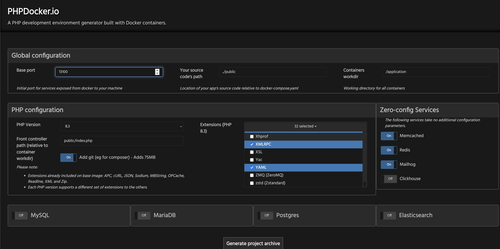

<!--
author: Francisco Abayon
head: https://www.gravatar.com/avatar/dd90d96a247f981286ae0092abc026ba.jpg
date: 2024-04-06    
title: Codeigniter 3 - PHP Container
tags: codeigniter3, framework, php, configuration, composer, container
images: blog/img/codeignier-3-repository.png
category: Codeigniter 3 Upgrades
status: draft
summary: Rapid PHP Containerization from phpdocker.io!
-->
## Motivation
When i was software engineer, i'm using *Codeigniter 3* framework, at that time that was the meta framework in PHP with MVC structure, and i want this to educate to developers who are going to upgrade there legacy pp with codeignter 3

## Problem Context
Codeigniter is not well integrated in composer, the library for PHP, then it using standard installation without containers and even there is no unit or integration with PHPUnit, lets address with that with initial structure


## Pathfinding Solution
First, let's create a <a href="https://github.com/CurlyBytes/codeigniter-3-upgrades" target="_blank" rel="nofollow">repository</a>.


Then visit to <a href="https://phpdocker.io/" target="_blank" rel="nofollow">php docker</a> generator


Open you vscode and create folder in the root with a name of *public* and *scripts*, unzip the phpdocker files and paste all files and folders inside to *scripts* folder and modify the things as follows:
- change the version of php to 7.4 since thats the php versino that codeigniter supported with its frameworks
- explicit versino of nginx alpine and use thi __image: 'nginx:1.21.6-alpine'__
- modify the docker-compose.yml file and mount the volume of folder *public* to container *public* so that we can update the code on hot reload
- modify the dockerfile and docker compose from 7.4 to __${PHP_VERSION}__ lets change it to variable level since this is going to be changing base on your current php version available in your hosting provider, in this article lets use the 7.4 instead
- add this line of codes below in the docker file, modify it accordingly
```dockerfile
ARG  PHP_VERSION=7.4
ENV appname="blog"
ENV versionmajor="1"
ENV versionminor="1"
ENV versionpatch="1"
ENV appversion="v.${versionmajor}.${versionminor}.${versionpatch}"
ENV appauthor="Francisco Abayon"

LABEL name="${appname}" \
      version="${appversion}" \
      author="${appauthor}" \
      description="CurlyBytes Codeigniter 3 upgrades" 
        
```
- and lastly add the .env file inside in the *scripts* folders as well and add the following lines of code
```.env
PHP_VERSION=7.4
APPNAME=codeigniter3upgrades
BASE_LINK="http://localhost:13100/"
```

add **index.php** in the *public* folder with hello world in it

```php
<?php
echo "Hello World!<br>";
?>
```
go to your terminal/cli application, navigate to your *scripts* folder and run the docker compose command
```bash
docker compose up -d --build
```

and now you have a working hello world php containerization setup.

